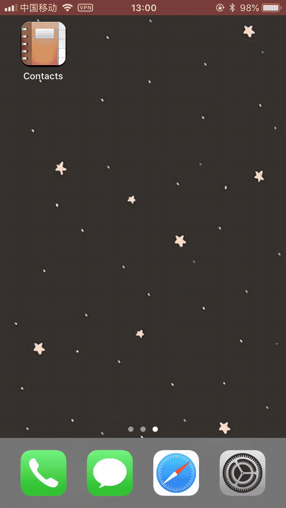
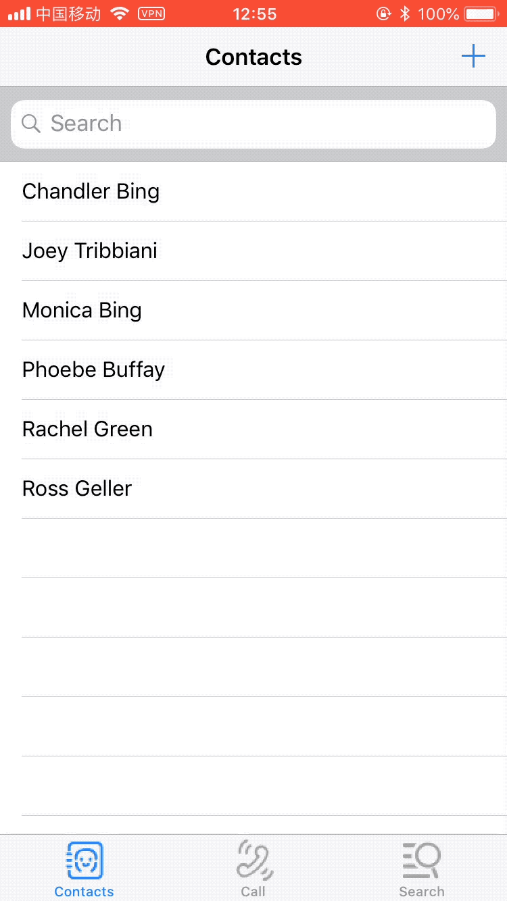
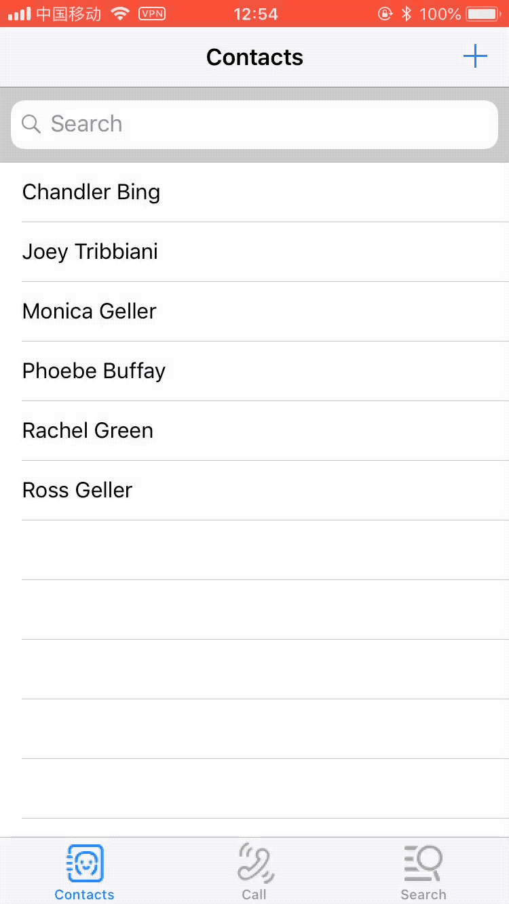
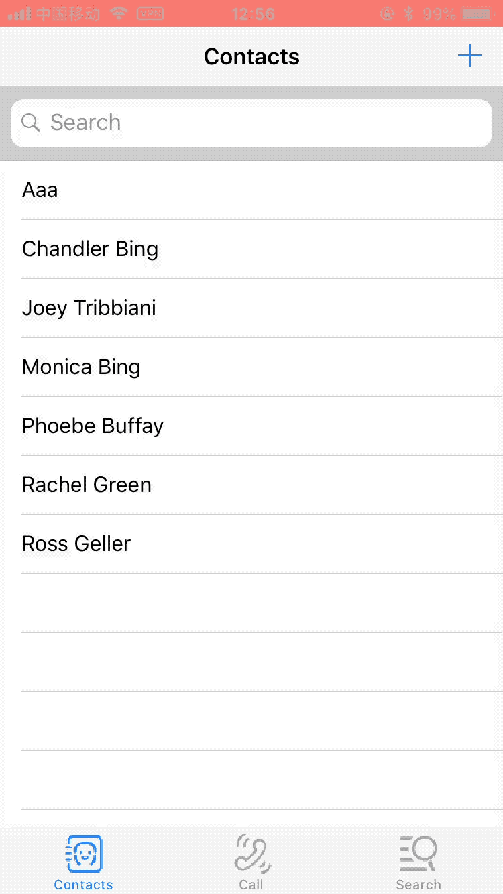
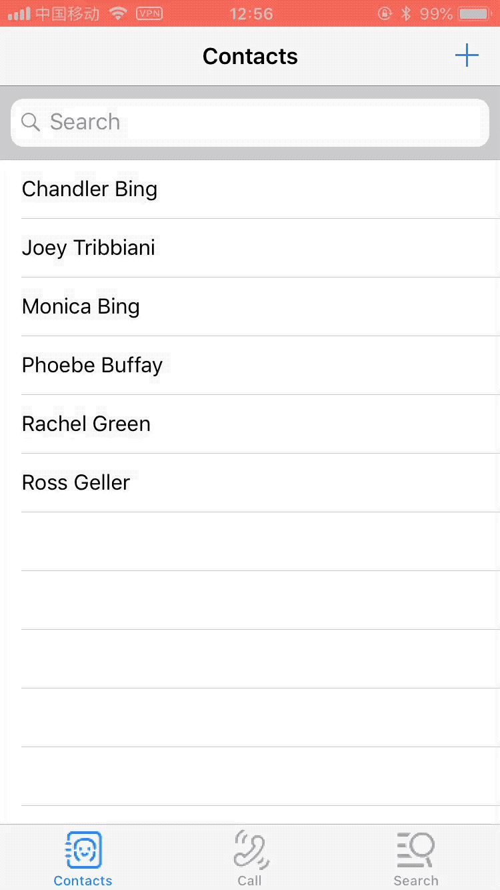
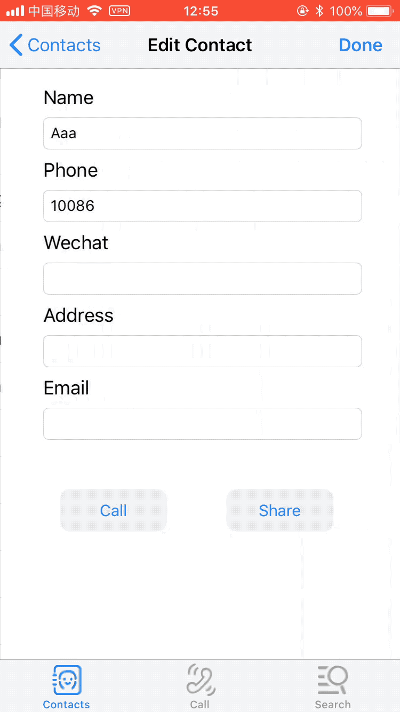
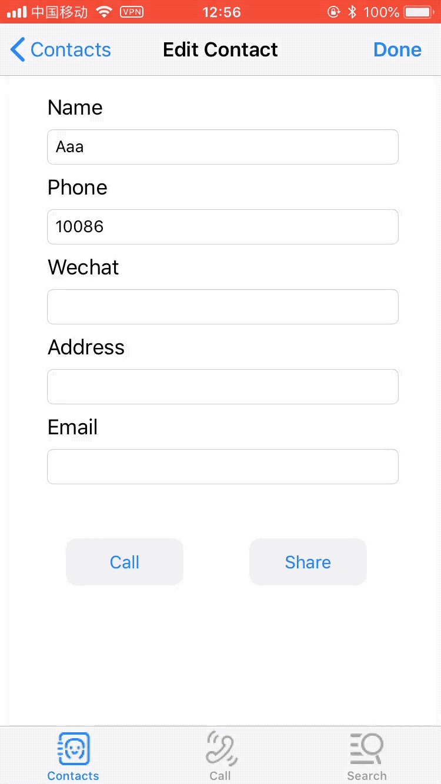
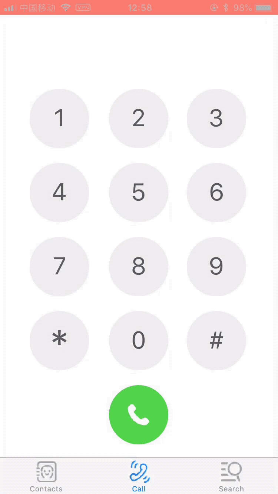
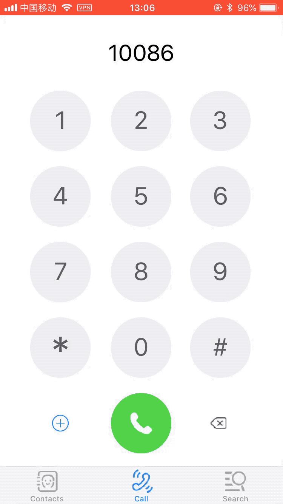

# PhoneContacts

iPhone通讯录应用，基本功能包括通讯录、拨号、网页搜索。

## 安装
- 将项目clone或download至本地
- 在Xcode中打开项目
- 选择真机或模拟器，运行项目

## 环境
- 开发环境：macOS High Sierra v10.13.5
- 测试环境：iOS v11.3
- IDE：Xcode v9.3.1

## 参考资料
- Apple API Reference
- SQLite3 Documentation

## 功能设计 
- 应用程序整体共分为三部分：联系人列表页面、拨号页面、百度搜索页面。其中，联系人列表为起始页面。
- 联系人列表页面元素有：联系人列表、搜索栏、添加联系人按钮
	- 点击列表单个联系人，可进入联系人详情页面，编辑联系人信息
	- 选中并向左滑动列表内单个联系人，可删除该联系人
	- 点击添加按钮，可进入新增联系人页面，添加联系人信息。
	- 点击搜索栏，输入检索关键字，列表自动实时更新显示检索结果。点击单个检索结果可进入联系人详情页面
	- 编辑/新增联系人完成后，点击右上角导航栏中Done按钮，可保存并回退至联系人列表页面；点击左侧返回按钮则不保存并回退
	- 若提交时Name栏为空，则弹出对话框提醒输入
	- 联系人详情页面内，点击下方左侧按钮Call，可调用系统拨号功能呼叫联系人
	- 联系人详情页面内，点击下方右侧按钮Share，可调用系统分享功能，可将联系人信息以纯文本形式共享至其他应用
- 拨号页面元素有：拨号显示栏，拨号键盘，撤销输入按钮，新增联系人按钮
	- 仿原生界面、圆形按钮
	- 点击拨号键盘，对应数字显示在拨号显示栏中
	- 拨号完成后可点击正下方呼叫按钮，对所拨号码进行呼叫
	- 开始拨号时，撤销输入按钮和新增联系人按钮动态展示。无输入内容时隐藏
	- 点击新增联系人按钮，可弹出带有文本输入框的对话框，可输入姓名及号码新建联系人。其中号码栏默认为拨号栏中已输入数字，若提交时检测姓名栏为空，则弹出对话框提醒输入
- 网页搜索页面
	- 默认为百度页面，可进行关键词搜索

## 相关技术/工具/api
- 使用SQLite3数据库存储联系人数据
- 使用NSFileManager对数据库本地文件及沙盒文件路径进行处理
- 使用UITabBarController分栏
- 使用UINavigationController管理联系人列表页与详情页面的层次关系
- 使用UIToolbar处理收起键盘动作
- 使用UITableViewController，以TableView列表展示联系人信息
- 使用UISearchController展示搜索栏并处理搜索结果
- 使用UIActivityViewController调用系统分享菜单
- 使用UIApplication调用系统拨号
- 使用UIAlertController展示对话框
- 使用UIRectCorner* 对按钮圆角外观进行处理
- 使用WKWebView展示网页内容

## 示例
- 页面总览  
	
	    
- 添加联系人  
	
	    
- 修改联系人  
	
	    
- 删除联系人  
	
	    
- 检索联系人  
	
	    
- 分享联系人  
	
	    
- 拨打电话  
	
	    
- 拨号  
	
	     
- 新增联系电话  
	
